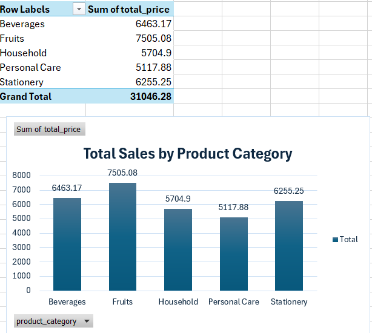
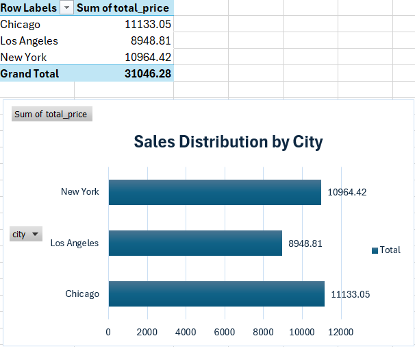
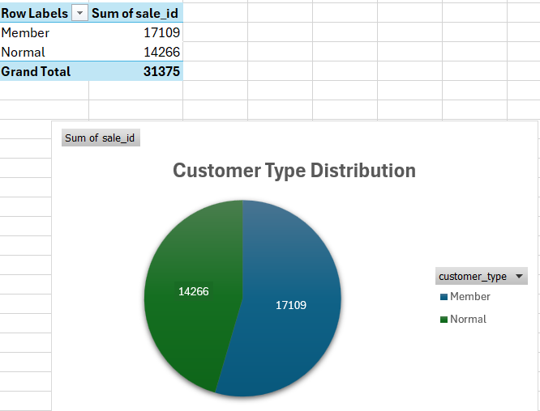

Supermarket Sales Data Analysis Report

1. Data Overview

The dataset used in this analysis is the “Supermarket Sale” dataset. The dataset contains information about supermarket transactions, including customer type, product category, quantity sold, and total sales amount. The dataset contains approximately 254 rows and 8 columns. This dataset is useful for analysing sales performance and customer purchasing behaviour.

2. Data Cleaning

During the data cleaning process, missing values in the “Quantity” column were replaced using the average value of the column, which was rounded to 11. For missing values in text columns such as “Customer_type” and “Product_category”, mode was used to replace the blank cells. In addition, duplicate rows were identified and removed to improve data accuracy and data quality.

3. Descriptive Statistics and Visualisation

Several visualisations were created to better understand the dataset, including:
- Total Sales by Product Category
- Sales by City
- Customer Type Distribution

Based on descriptive statistics, the average sales amount was approximately 124.19 USD. The highest sales value recorded was 427.14 USD, while the minimum sales value was 2.18 USD.

4. Data Visualisation and Analysis

4.1 Sales by Product Category
## Visualisation

Insight 1: The Fruits category generated the highest total sales among all product categories. This suggests that fruit products are the most demanded items and contribute significantly to the supermarket’s overall revenue.

4.2 Sales Distribution by City
## Visualisation

Sales performance differed across cities, indicating variations in customer purchasing activity. Some cities generated higher sales revenue than others, suggesting differences in customer demand and shopping behaviour across locations.

4.3 Customer Type Distribution
## Visualisation

Insight 2: Member customers made more purchases compared to Normal customers. This indicates that loyalty membership programs may encourage customers to shop more frequently and improve customer retention.

Author
Phan Ngọc Châu
